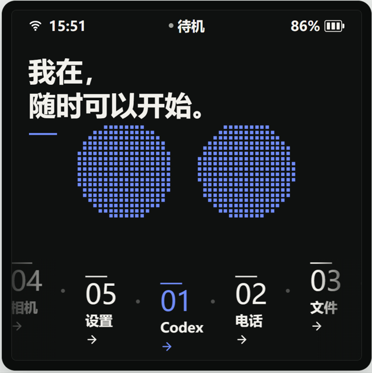

# Metalio Claw4 Agent UI 固件

本仓库是 Metalio Claw4（ESP32-P4 主控）的独立 ESP-IDF 固件工程，包含板级
驱动、音频、显示、Agent UI、网络协议和本地 ESP-IDF 组件。PC bridge 不属于本仓库，
设备连接协议中的端口、消息和认证约定应与对应的 PC bridge 版本保持一致。

## 界面预览

<p align="center">
  
</p>

## 快速链接

- 固件仓库：[CloudZao/MetalioClaw4](https://github.com/CloudZao/MetalioClaw4)
- 上游架构：[小智 AI (xiaozhi-esp32)](https://github.com/78/xiaozhi-esp32)

## 固件功能

这是面向 Metalio Claw4 的 **Agent UI 版固件**。它保留完整的板级、联网、音频和
电源管理能力，并提供由 720 × 720 触控界面驱动的以下功能：

- **AI 语音交互**：支持 ESP-SR 本地唤醒、语音活动检测、流式录音与播放，并通过
  WebSocket 或 MQTT + UDP 与已配置的语音服务建立会话；界面会同步显示聆听、思考、
  播放、错误和充电等状态。
- **Codex 远程任务**：可自动发现局域网内的 PC bridge，或手动填写主机地址，并使用
  Bearer Token 建立 WebSocket 连接。支持按住说话提交任务、显示对话与任务状态、处理
  操作审批、新建任务，以及长按停止正在运行的任务。
- **设备端 MCP 工具**：向 AI 暴露设备状态、音量、屏幕亮度与主题、相机拍照和应用
  跳转等能力；系统级工具还可读取设备信息、重启、截屏和预览图片。
- **相机与相册**：提供摄像头实时预览、拍照、拍后确认、保存或丢弃，以及 SD 卡照片
  相册、全屏查看和删除；相册最多加载最新 48 张 JPEG 照片，以限制设备端内存占用。
- **电话**：在带 NT26 4G 模组的设备上提供拨号盘、拨号和挂断；语音通话需要可用的
  外置 SIM 卡，内置卡用于数据联网时不能直接拨号。
- **文件管理**：浏览 SD 卡目录和容量，预览 JPEG、PNG、SJPG 与 TXT 文件，支持删除
  文件，并可将 SD 卡切换为 USB 大容量存储设备供电脑访问。
- **网络与蓝牙**：可扫描、保存并连接 Wi-Fi，在 Wi-Fi、内置蜂窝卡和外置 SIM 卡之间
  切换；可扫描和连接外部蓝牙音频设备，并选择本机扬声器、音乐模式或通话模式。
- **界面与系统设置**：主页提供 Codex、电话、文件、相机和设置五个应用入口，并显示
  网络、电量和充电状态。设置中可调整浅色/深色外观、强调色、亮度、音量、待机时长、
  语音唤醒和简体中文/English；同时提供待机锁屏、滑动解锁、触觉反馈、重启和关机。

部分功能依赖外部条件：Codex 需要兼容的 PC bridge；云端语音需要有效的服务配置；
相机相册和文件管理需要 SD 卡；蜂窝通话、蓝牙音频及相关状态显示需要对应硬件正常工作。
本公开导出也不包含授权受限的提示音、工厂测试资源或设备凭据。

## 目录结构

```text
CMakeLists.txt       ESP-IDF 工程入口
sdkconfig            Metalio Claw4 的已验证配置
dependencies.lock    ESP-IDF Component Manager 锁定文件
main/                应用、板级驱动、协议、音频和 Agent UI
components/          本地组件：codex_remote、json、uart-uhci、ui_dispatcher
partitions/           分区表（打包脚本使用 partitions/v1/32m.csv）
scripts/              资源生成工具及构建/烧录/监视脚本
LICENSE               固件许可证
```

`managed_components/` 和 `build/` 是 ESP-IDF 在本机生成的目录，不属于源代码，
不会随仓库发布。大体积语音、模型、SD 卡和工厂测试资源也不在公开导出中。

## 环境要求

- ESP-IDF **v6.0.2**，目标芯片 ESP32-P4；不要用其他版本替代。
- ESP-IDF 提供的 Python 环境、CMake、Ninja 和 esptool。
- Windows PowerShell、Linux 或 macOS 均可构建；烧录和串口监视需要目标设备及其
  USB Serial/JTAG 端口。

准备好 ESP-IDF 后，在当前 shell 导出环境。Windows 示例：

```powershell
& C:\path\to\esp-idf\export.ps1
idf.py --version
```

应确认显示 6.0.2，再执行后续命令。Component Manager 会根据
`main/idf_component.yml` 和 `dependencies.lock` 下载受管组件；不要手动提交
`managed_components/`。

## 构建

直接使用 ESP-IDF：

```powershell
idf.py build
```

或使用脚本（脚本会先执行完整构建并检查 32 MB 分区表中的 14 MiB factory app）：

```powershell
powershell -ExecutionPolicy Bypass -File .\scripts\package-esp32.ps1 -IdfPath C:\path\to\esp-idf
```

打包结果位于本仓库的 `build/esp32/`：

```text
Agent-ESP32P4-full.bin       32 MiB 完整镜像（含分区表；空分区填充为 0xFF）
Agent-ESP32P4-app.bin        仅 factory app 镜像
Agent-ESP32P4-firmware.zip   上述镜像的归档
```

ESP-IDF 临时产物仍位于 `build/` 根目录。打包成功只证明本机源码和工具链通过了
脚本检查，不代表镜像已经烧录或设备已经完成真机验证。

## 安全烧录

烧录前先确认端口、芯片型号、分区表和镜像来源。建议先使用 `-DryRun` 检查目标：

```powershell
powershell -ExecutionPolicy Bypass -File .\scripts\flash-esp32.ps1 -Port COM10 -IdfPath C:\path\to\esp-idf -DryRun
```

确认无误后，完整镜像写入 `0x0`，会覆盖分区表及数据分区：

```powershell
powershell -ExecutionPolicy Bypass -File .\scripts\flash-esp32.ps1 -Port COM10 -IdfPath C:\path\to\esp-idf
```

如果只需更新应用并保留设备设置、NVS 等数据，使用 app-only 脚本。它会验证
factory app 位于 `0x200000` 且不超过 14 MiB：

```powershell
powershell -ExecutionPolicy Bypass -File .\scripts\flash-esp32-preserve-settings.ps1 -Port COM10 -IdfPath C:\path\to\esp-idf -DryRun
powershell -ExecutionPolicy Bypass -File .\scripts\flash-esp32-preserve-settings.ps1 -Port COM10 -IdfPath C:\path\to\esp-idf
```

`-DryRun` 不会写入设备；去掉它才会调用 esptool。请不要把包含设备 Token、Wi-Fi
凭据、NVS 或完整 flash dump 的文件提交到仓库。

## 串口监视

监视脚本使用已经构建的 `build/agent.elf`，默认波特率 115200：

```powershell
powershell -ExecutionPolicy Bypass -File .\scripts\monitor-esp32.ps1 -Port COM10 -IdfPath C:\path\to\esp-idf
```

退出 `idf.py monitor` 使用 `Ctrl+]`。串口日志和实际设备行为属于硬件验证证据，
不能用构建、打包或 dry-run 输出替代。

## 公开导出中的资源边界

公开仓库只保留可审计的源码、配置、分区表、脚本和许可证。以下本地资源被有意排除：

- `main/factory-test-assets/`：仅用于可选的 `factory_test` SPIFFS 镜像。
  CMake 在目录存在时才生成该镜像；目录缺失会给出 warning 并跳过，不影响正常 AgentUI
  固件构建。公开导出不包含其中的音频文件；若要发布工厂测试镜像，必须由拥有授权的环境
  提供资源，不能伪造占位文件。
- `managed_components/`、`build/`、`wakeword/srmodels.bin`、`sd_images/`、
  `esp_claw_bin/`、厂商二进制镜像以及语言/提示音 OGG。

缺少可选 `wakeword/srmodels.bin` 时，工程使用 Component Manager 提供的默认模型；
缺少工厂测试资源时不要误以为已经完成了完整发布构建。

公开版不包含语言/提示音 OGG。`main/assets/lang_config.h` 为缺失的提示音提供空的
`std::string_view`，统一播放入口会安全跳过空资源，因此构建和显示、网络、语音主流程
仍可验证，但相关提示音会静音。需要提示音的发布包必须在获得授权后，将资源放入对应
语言目录再构建；不要提交来源或许可不明的音频。

## 许可证与第三方组件

固件许可证见 [`LICENSE`](LICENSE)。`components/uart-uhci/idf_component.yml` 保留
其 Apache-2.0 元数据；ESP-IDF、LVGL、ESP-SR、音频编解码器及其他 Component Manager
依赖各自适用的许可证和 NOTICE，公开发布前应逐项核对其再分发条件。
