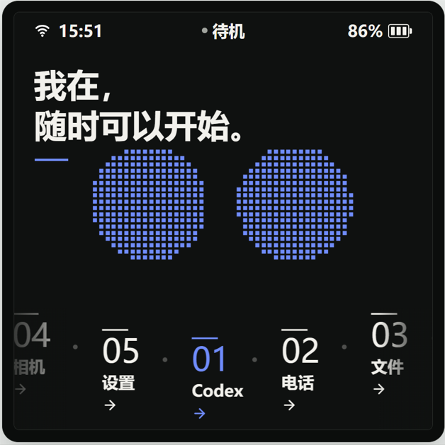

# Metalio Claw4 Agent UI

运行在 Metalio Claw4（ESP32-P4）上的触屏固件，提供 Codex、相机、文件、电话和设置等应用。

## Codex App 怎么用

先在电脑上打开 Codex 和配套的 **Codex Remote**，按 PC 项目的 README 完成驱动安装与语音设置。

### 1. 连接电脑

1. 让设备和电脑连接同一个局域网。
2. 从设备主页打开 **Codex → 菜单 → 连接**。
3. 选择 **局域网**，等待发现电脑。
4. 填写 PC 程序中的 **设备认证 Token**，点击 **连接**。
5. 看到 **PC 桥接 / Codex 已连接**后就可以使用。

### 2. 选择任务

打开 **菜单 → 任务**，点击要继续的任务。列表最多显示六个任务。

想开始新对话，点击 **新建任务**，等准备好后说出第一条消息。发送后等待任务同步，再继续对话。

### 3. 按住说话

1. 按住底部 **按住说话**。
2. 等按钮显示 **松开发送**后讲话。
3. 说完松开，等待回复。

不想发送时，保持按住并向上滑动，看到 **松开取消**后松手。

声音来源由 PC 设置决定：选 **ESP32 麦克风**就对着设备说，选 **电脑麦克风**就对着电脑说。日常使用选择 **虚拟 Codex Micro**；API 转写目前尚未接通自动发送。

### 4. 查看回复与操作

| 想做什么 | 怎么操作 |
| --- | --- |
| 查看回复 | 在对话页滚动查看最近消息，完整历史在电脑上看 |
| 停止任务 | 长按 **停止**约 1.2 秒 |
| 处理审批 | 阅读卡片，点击对应选项 |
| 回答问题 | 点击选项；多题或多选时，再点 **提交回答** |
| 更换模型 | 打开 **菜单 → 模型**，调整模型、推理强度或 Fast |
| 关闭光圈或提醒音 | 打开 **菜单 → 连接**，调整对应开关 |

需要输入文字、设备上没有选项的问题，请回到电脑回答。按钮显示准备中、提交中或待同步时，等状态更新后再操作。

## 连不上或不能说话？

- **找不到电脑**：检查同一局域网、PC 程序和防火墙。
- **连接失败**：检查两端 Token 是否一致。
- **Codex 已断开**：在电脑上打开 Codex，查看 PC 程序的连接状态。
- **说话没有文字**：检查 PC 的麦克风来源；ESP32 模式还需要 VB-CABLE，Codex 麦克风选 **CABLE Output**。
- **没有发送成功**：检查 PC Micro 连接和 **CODEX** 发送命令绑定，再确认目标任务已同步。

## 开发与烧录

已有固件的设备可以直接使用。自行编译或更新固件，请看 [开发与烧录说明](docs/development.md)。

常用构建、打包、烧录和串口监控命令见 [开发命令](scripts/README.md)。

固件仓库：[CloudZao/MetalioClaw4](https://github.com/CloudZao/MetalioClaw4) · 上游：[小智 AI](https://github.com/78/xiaozhi-esp32) · [许可证](LICENSE)
